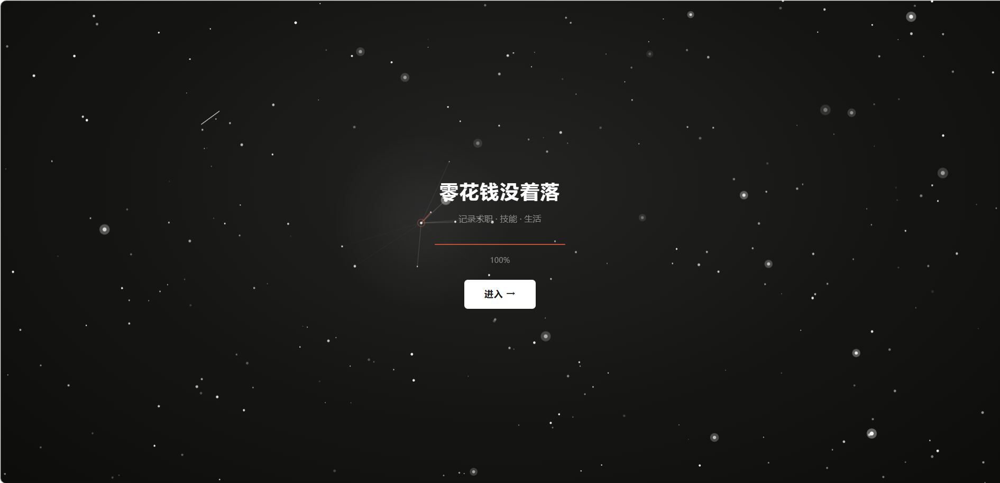
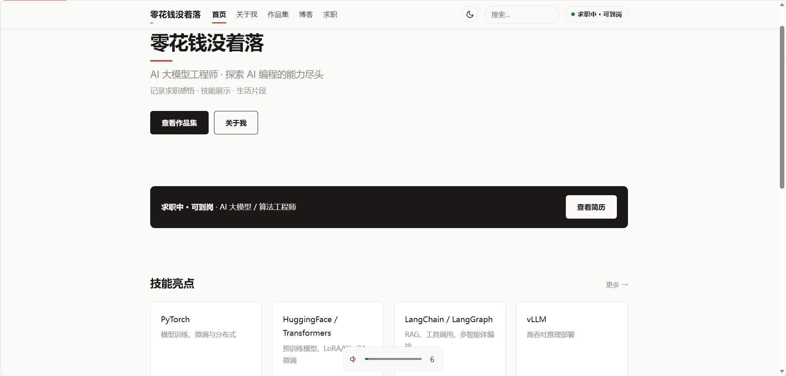
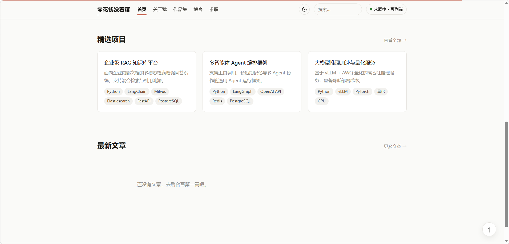

# 漫画灰个人博客（Django）

[](https://www.python.org/)
[](https://www.djangoproject.com/)

一个**偏求职 + 技能展示（作品集导向）**的个人博客，中文为主。视觉采用「漫画灰 + 朱砂红」风格，内置深色模式、星空粒子加载页与滚动动效。纯 Python 技术栈，无 Node 构建链。

## ✨ 功能特性

- **作品集导向首页**：Hero 定位、技能亮点、精选项目、求职状态、最新文章
- **博客**：Markdown 写作 + Pygments 代码高亮；分类、标签、分页；上一篇 / 下一篇；阅读量统计
- **自建评论**：支持回复与后台审核，蜜罐字段防垃圾
- **求职与简历**：求职状态展示、在线简历（可打印导出 PDF）、简历 PDF 下载
- **生活相册**：图片墙 + 灯箱（键盘切换），隐蔽入口（页脚低对比小字，不进主导航）
- **站内搜索**：标题 / 摘要 / 正文 / 标签，关键词高亮
- **视觉与交互**：漫画灰 + 朱砂红点缀、深色模式（记忆偏好）、星空粒子加载页（视差 + 鼠标星座连线 + 流星）、滚动入场动画、阅读进度条、回到顶部
- **Django Admin**：在线写作、评论审核、项目 / 技能 / 相册管理

## 技术栈

| 层 | 选型 |
|---|---|
| Web 框架 | Django 5 |
| 数据库 | SQLite（可平滑切换 PostgreSQL） |
| 文章渲染 | Markdown + Python-Markdown + Pygments |
| 图片处理 | Pillow |
| 前端 | 手写 CSS（CSS 变量，深浅色）+ 原生 JS，无 Node 构建链 |

## 快速开始

```bash
# 1. 创建虚拟环境并安装依赖
python -m venv venv
# Windows:
venv\Scripts\activate
# macOS / Linux:
source venv/bin/activate

pip install -r requirements.txt

# 2. 建库
python manage.py migrate

# 3. 初始化数据（二选一）
python manage.py seed            # 最小基础数据
python manage.py fill_profile    # 完整「AI 大模型工程师」示例资料

# 4. 创建后台管理员
python manage.py createsuperuser

# 5. 启动
python manage.py runserver
```

访问 <http://127.0.0.1:8000/>，后台 <http://127.0.0.1:8000/admin/>。

## 数据命令

| 命令 | 作用 |
|---|---|
| `python manage.py seed` | 初始化最小基础数据：博客分类、空白的个人资料 / 站点配置、示例技能与项目 |
| `python manage.py fill_profile` | 填充「AI 大模型工程师（3 年）」完整示例资料（个人资料、站点配置、16 项技能、4 个项目、3 条经历时间线，开启求职状态）。**会覆盖**技能 / 项目 / 经历；再次运行即可重置 |

## 项目结构

```
blog/
├── manage.py
├── config/            # 项目配置（settings / urls / wsgi）
├── core/              # 个人资料、站点配置、首页 / 关于 / 求职 / 简历 / 搜索 + 数据命令
├── blog/              # 文章、分类、标签、评论
├── portfolio/         # 项目、技能、经历时间线
├── gallery/           # 相册、照片
├── templates/         # 前台模板（base + 各页面）
├── static/            # 手写 CSS / JS（漫画灰设计系统）
├── media/             # 本地图片存储
├── docs/              # 设计文档
└── requirements.txt
```

## 设计文档

定位、数据模型、页面路由与「漫画灰」设计规范详见 [docs/DESIGN.md](docs/DESIGN.md)。

## 部署

动态站需要服务器，可选：

- **VPS**：Gunicorn + Nginx + SQLite
- **PaaS**：Railway / Render / Fly.io 一键部署

生产环境注意：

- 设置环境变量 `DJANGO_SECRET_KEY`、`DJANGO_DEBUG=0`、`DJANGO_ALLOWED_HOSTS=你的域名`
- `python manage.py collectstatic`
- 媒体文件可用本地磁盘，或接入对象存储（S3 / OSS）

## 许可证

建议使用 [MIT License](https://opensource.org/licenses/MIT)，可在根目录自行添加 `LICENSE` 文件。




